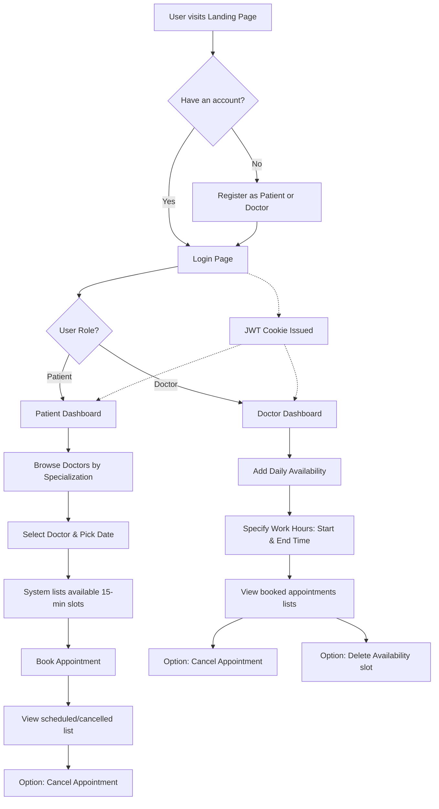

# MediBook: Hospital Appointment Booking System

Welcome to the **Hospital Appointment Booking System** (MediBook), a secure, role-based healthcare coordination platform designed to bridge the gap between patients and medical professionals. This system automates doctor availability management, appointment scheduling, and patient-doctor interactions via a clean and modern web interface.

---

## 📂 Table of Contents
1. [Why We Built This System](#1-why-we-built-this-system)
2. [How It Is Different from Existing Systems](#2-how-it-is-different-from-existing-systems)
3. [Core Advantages](#3-core-advantages)
4. [Technology Stack](#4-technology-stack)
5. [Tech Stack & Language Rationale](#5-tech-stack--language-rationale)
6. [Detailed System Workflow](#6-detailed-system-workflow)
7. [Libraries, Packages & Functions](#7-libraries-packages--functions)
8. [Glossary of Technical Terms (Layman's Definitions)](#8-glossary-of-technical-terms-laymans-definitions)
9. [Project Directory & Core Files](#9-project-directory--core-files)

---

## 1. Why We Built This System
In traditional healthcare settings, scheduling medical appointments remains a significant pain point. Patients face long queue times, phone call delays, and lack of real-time visibility into doctor schedules. Conversely, doctors struggle to manage their daily availability, leading to double-bookings, empty slots, or scheduling overlaps.

We built this platform to:
- **Streamline Coordination**: Automate the booking pipeline, removing administrative intermediaries.
- **Ensure Real-Time Synchronicity**: Provide patients with live, auto-calculated doctor availability.
- **Secure Healthcare Operations**: Implement robust role-based access control, protecting medical credentials and patient history.
- **Enhance Self-Service**: Allow patients to find specialists, select open time slots, and self-manage bookings or cancellations from anywhere.

---

## 2. How It Is Different from Existing Systems
While commercial scheduling systems exist, they are often over-engineered, slow, or contain security loopholes. Here is how MediBook stands out:
- **True Conflict-Free Booking**: The core engine calculates availability down to the minute. Once a 15-minute slot is selected and booked, it is instantly removed from the doctor's active pool, preventing double-bookings.
- **Strict Role Isolation**: Distinct, non-overlapping dashboards exist for patients and doctors. Doctors cannot access patient medical databases, and patients cannot alter doctor rosters.
- **No Third-Party Tracker / Zero External Authentication Dependencies**: Unlike systems relying on external OAuth providers (Google, Facebook) which can leak patient activity data, MediBook utilizes self-hosted JWT authentication.
- **Secure Password Recovery offline**: Using a custom security question/answer vault, users can reset lost credentials securely without relying on external SMTP/email microservices.

---

## 3. Core Advantages
- **High Performance & Speed**: Powered by FastAPI, the application delivers responses with minimal latency compared to traditional Python frameworks (like Django).
- **Secure Storage of Credentials**: Passwords are saved as one-way cryptographic hashes using the `bcrypt` algorithm.
- **JWT & HTTP-Only Cookie Security**: User sessions are stored in HTTP-Only cookies, shielding the application from Cross-Site Scripting (XSS) attacks.
- **Server-Side Security Verification**: Route access is protected using FastAPI security dependencies that dynamically parse user roles on every request.
- **Flexible Deployment Options**: Can be run locally as a lightweight app or packaged into Docker containers for high-scalability hosting environments like Google Cloud Run.

---

## 4. Technology Stack

### Backend Logic & Routing
*   **Language**: Python 3.8+
*   **Web Framework**: FastAPI (High-performance ASGI framework)
*   **Server Engine**: Uvicorn (Asynchronous Server Gateway Interface)

### Data Persistence (Database Layer)
*   **Database Engine**: SQLite (Local database file `hospital.db`)
*   **Object-Relational Mapping (ORM)**: SQLAlchemy (Translates Python models directly into relational SQL tables)

### Session & Security
*   **Authentication**: JSON Web Tokens (JWT) using `python-jose`
*   **Hashing**: Bcrypt password hashing
*   **Session Management**: Encrypted HTTP-Only browser cookies

### Frontend Rendering & Interaction
*   **Templating Engine**: Jinja2 (Dynamic server-rendered HTML pages)
*   **UI Structure & Styling**: HTML5, Vanilla CSS3 (Custom styling with rich, responsive layouts)
*   **Client Scripting**: Vanilla JavaScript (Async Fetch API calls to backend endpoints)

---

## 5. Tech Stack & Language Rationale
Choosing a technology stack is a trade-off between speed, safety, and complexity. Below is the rationale behind our selection:

### Why Python?
*   *Alternative Considered*: Node.js (JavaScript) or Java.
*   *Rationale*: Python is highly readable, which reduces bug frequency. It has powerful native date/time libraries essential for calendar calculations, and robust security libraries (`bcrypt`, `jose`) that are heavily audited.

### Why FastAPI instead of Django or Flask?
*   *Alternative Considered*: Django or Flask.
*   *Rationale*: 
    *   **Flask** is simple but lacks modern asynchronous support (ASGI) and does not provide automatic type validation.
    *   **Django** is powerful but carries huge overhead (bloat) and operates synchronously.
    *   **FastAPI** is built on modern ASGI standards, supporting thousands of concurrent requests. It automatically validates inputs using Pydantic schemas, drastically reducing coding errors.

### Why SQLite instead of PostgreSQL or MySQL?
*   *Alternative Considered*: PostgreSQL or MongoDB.
*   *Rationale*: For small-to-medium scale applications, hosting a database server (like Postgres) adds operational cost and maintenance. SQLite stores all data in a single, local file (`hospital.db`), eliminating network latency and simplifying backups. If traffic scales up, SQLAlchemy allows us to migrate to PostgreSQL by modifying a single database URL string in [database.py](file:///c:/Users/laksh/workspace/workspace/Projects/hospital%20appointment%20booking/database.py).

### Why Jinja2 Server-Side Templates instead of React/Next.js?
*   *Alternative Considered*: React, Angular, Vue.
*   *Rationale*: A Single Page Application (SPA) framework like React requires a build pipeline (Webpack/Vite), increases load times for patients, and introduces complex state synchronization issues. Jinja2 renders the templates directly on the server. This speeds up page loads, simplifies the codebase, and prevents client-side rendering security exploits.

---

## 6. Detailed System Workflow

The following flowchart illustrates the user flows and system operations:

### A. Authentication & Registration Workflow
1. The user registers as a **Patient** or **Doctor** via the UI form.
2. The password is encrypted on the server using `bcrypt` and saved in the database.
3. If registering as a doctor, the user can upload a profile image which is stored locally in the server's filesystem under `static/uploads/`.
4. Upon validation, the server issues a JSON Web Token (JWT) containing the user’s email. The token is packed in a secure HTTP-Only cookie named `access_token`.

### B. Doctor Availability Setup Workflow
1. A doctor logs in and accesses the **Doctor Dashboard**.
2. Under "Add Availability", the doctor enters a date (e.g., `2026-06-03`) and their shift time (e.g., `09:00` to `12:00`).
3. This creates a record in the database availability table.

### C. Patient Booking Workflow
1. A patient logs in and views their dashboard.
2. The patient filters doctors by name or specialization (e.g., Cardiology, General Medicine).
3. Upon selecting a doctor, the frontend requests the doctor’s available dates via the API.
4. When the patient selects a date:
   * The backend looks up the doctor's shift (e.g., `09:00` to `12:00`).
   * The backend splits this window into **15-minute segments** (`09:00 AM`, `09:15 AM`, `09:30 AM`, etc.).
   * The backend queries the database for existing scheduled appointments for that doctor on that date.
   * Already-booked slots are filtered out.
   * Only the remaining conflict-free time slots are sent back and displayed to the patient.
5. The patient selects a slot and clicks **Book**. A new appointment record is created with the status `scheduled`.

---

## 7. Libraries, Packages & Functions

The system relies on dependencies listed in [requirements.txt](file:///c:/Users/laksh/workspace/workspace/Projects/hospital%20appointment%20booking/requirements.txt). Here is what each package does:

| Package Name | Purpose / Function in the System |
| :--- | :--- |
| **`fastapi`** | The core framework. It handles HTTP requests, maps routes (endpoints), automatically validates incoming data schemas, and returns responses. |
| **`uvicorn`** | The ASGI web server. It acts as the engine that runs our FastAPI application locally and listens for incoming browser requests on port `8000`. |
| **`sqlalchemy`** | The Database Mapper (ORM). It allows us to manage tables, query appointments, and save doctor availability using standard Python code instead of raw SQL queries. |
| **`bcrypt`** | Cryptographic security. It hashes passwords during registration and checks passwords during login, protecting against password theft and database leaks. |
| **`python-jose[cryptography]`** | Security Token handler. It handles generating, signing, and decoding secure JSON Web Tokens (JWT) for user sessions. |
| **`python-multipart`** | File upload utility. It allows FastAPI to process form data that includes binary files, enabling doctors to upload their profile pictures. |
| **`jinja2`** | HTML rendering tool. It dynamically generates HTML pages by injecting variables (like doctor names and appointment tables) into templates before sending them to the browser. |
| **`email-validator`** | Input validation. Ensures that email addresses entered during registration conform to strict email layout standards. |

---

## 8. Glossary of Technical Terms (Layman's Definitions)

Here is a simple dictionary explaining the keywords used in this project:

*   **API (Application Programming Interface)**: A bridge that allows different software components to talk to each other. For example, our frontend web page calls our backend API to fetch the list of doctors from the database.
*   **Role-Based Access Control (RBAC)**: A security policy where users are grouped into roles (e.g., "Doctor" vs. "Patient"), and access to specific pages or actions is restricted depending on which role they belong to.
*   **FastAPI**: A modern, high-speed software tool used by developers to build APIs quickly. It is written in Python and is highly optimized.
*   **Flask**: An older, lightweight web framework in Python. Unlike FastAPI, it doesn't support asynchronous tasks by default and lacks automatic input validation features.
*   **Jinja2 Template**: A standard HTML file containing special placeholder tags (like `{{ user.full_name }}`). When the server processes this template, it replaces the placeholders with real data and sends a standard webpage to the browser.
*   **JWT (JSON Web Token)**: A compact, secure stamp containing user details (like email and role). The server issues this stamp after login, and the browser sends it back on every request to prove who the user is.
*   **HTTP-Only Cookie**: A secure storage bucket in the web browser. Only the browser can read it, and it cannot be accessed or stolen by JavaScript code, protecting against hacking attempts.
*   **ORM (Object-Relational Mapper)**: A translator that converts database rows (SQL) into objects in a programming language (like Python). It saves developers from writing complex SQL query languages manually.
*   **SQLite**: A simple database system that stores all its tables and records in a single normal file on your hard drive, without requiring a separate database server.
*   **Hashing**: A security process that takes a password and runs it through a mathematical formula to turn it into a scrambled string of letters. This process cannot be reversed, meaning even if hackers steal the database, they cannot view original passwords.

---

## 9. Project Directory & Core Files

To explore the codebase, click on the files below:

*   [app.py](file:///c:/Users/laksh/workspace/workspace/Projects/hospital%20appointment%20booking/app.py): The main entry point containing all URL paths, backend logic, and API endpoints.
*   [models.py](file:///c:/Users/laksh/workspace/workspace/Projects/hospital%20appointment%20booking/models.py): Contains the SQLite database tables representation (User, Doctor, Patient, Appointment, DoctorAvailability).
*   [auth.py](file:///c:/Users/laksh/workspace/workspace/Projects/hospital%20appointment%20booking/auth.py): Implements security functions such as password hashing (`bcrypt`), JWT token generation, and login checks.
*   [database.py](file:///c:/Users/laksh/workspace/workspace/Projects/hospital%20appointment%20booking/database.py): Establishes the connection to SQLite and manages sessions.
*   [schemas.py](file:///c:/Users/laksh/workspace/workspace/Projects/hospital%20appointment%20booking/schemas.py): Defines the input-output data structures expected by FastAPI.
*   [requirements.txt](file:///c:/Users/laksh/workspace/workspace/Projects/hospital%20appointment%20booking/requirements.txt): Lists the Python packages required to run the project.
*   [deployment_guide.md](file:///c:/Users/laksh/workspace/workspace/Projects/hospital%20appointment%20booking/deployment_guide.md): Simple instructions on running and deploying the system.
